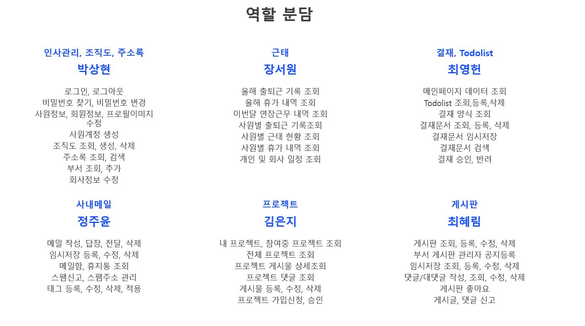
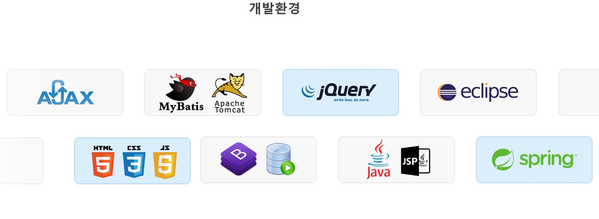

<h1>:briefcase: Project - WorkPeople</h1>

<h2>Contents</h2>
<ol>
 <li><a href="#outline">개요</a></li>
 <li><a href="#act">주요 기능</a></li>
 <li><a href="">구현 기능</a></li>
  <ul>
   <li><a href="">메인화면 프로젝트 리스트조회</a></li>
   <li><a href="">내 프로젝트 조회</a></li>
   <li><a href="">프로젝트 게시물관리</a></li>
   <li><a href="">프로젝트 관리자 승인</a></li>
  </ul>
 <li><a href="">Document</a></li>
</ol>

<h2 id="outline">:office: 개요</h2>
<li>프로젝트명 : Work Peple</li> 
<li>기획의도 : 누구나 쉽고 간편하게 사용할 수 있는 그룹웨어</li> 
<li>팀 소개</li>

<li>개발 환경</li>

<h2 id="act">:office: 주요 기능</h2>

